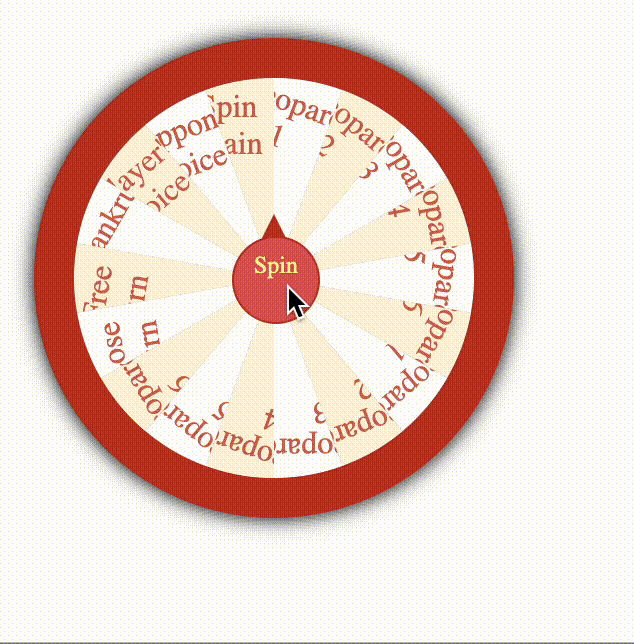

# File structure
Please open the src folder for all the source code of the wheel page. It has the basic structure of HTML + CSS + JavaScript structure. Please note that this is the basic draft of the wheel page. More features will be implemented in the next few days. 
- `index.html` is the index page of wheel page
- `style.css` is the stylesheet file for the wheel page
- `game.js` is the JS file for the wheel page

# How to run the code
1. Clone this repo 
2. Go to `jeopardy-app-randy/src` folder
3. Simply click `index.html` file and it will redirect you to your default web browser
4. Click the `spin` button and check out the result

# Demo
The basic version will have a result similar to the following. Stay tuned for more updates.

